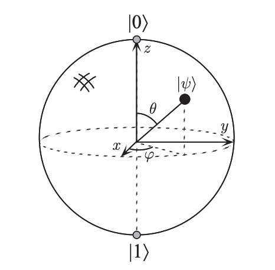

Before diving deeper into the project, let's tackle some theory ! 

> NB : all of the following information will mainly be excepted from Nielsen, M.A., & Chuang, I.L. (2010). *Quantum Computation and Quantum Information*. ( aka the bible when it comes to quantum information).

## Introduction : what's a qubit ? 

A classical bit can be in one of two states: `0` or `1`. Similarly, a quantum bit—or qubit—has two basis states, denoted $\lvert 0 \rangle$ and $\lvert 1 \rangle$, which correspond to the classical `0` and `1`. 

However, unlike a classical bit, a qubit can exist in a superposition of both states at once. Its general state is written as:

$$
\lvert \psi \rangle = \alpha \lvert 0 \rangle + \beta \lvert 1 \rangle,
$$

where $\alpha$ and $\beta$ are complex coefficients that satisfy the normalization condition:

$$
|\alpha|^2 + |\beta|^2 = 1.
$$

This ensures that the qubit's state vector has unit length. The set $\{ \lvert 0 \rangle, \lvert 1 \rangle \}$ forms an orthonormal basis for a two-dimensional complex Hilbert space.

While a classical bit's state can be directly inspected (e.g., by reading a memory cell), a qubit behaves differently: quantum mechanics restricts us to probabilistic measurement outcomes. When we measure a qubit in the computational basis, we obtain the result:

- `0` with probability $|\alpha|^2$
- `1` with probability $|\beta|^2$

Because these probabilities must sum to one, the normalization condition follows naturally. Geometrically, this corresponds to the qubit’s state living on the surface of a unit sphere in complex vector space — a concept known as the Bloch sphere.

<!-- ## Physical Realizations of a Qubit

Despite their abstract mathematical description, qubits are very much real — their behavior has been experimentally verified across a wide range of systems. Different physical systems can be used to implement qubits, including:

- The two polarization states of a photon
- The spin states of a nucleus in a magnetic field
- Discrete energy levels of an electron in an atom (e.g., ground and excited states)

For instance, in atomic systems, we can encode $\lvert 0 \rangle$ as the ground state and $\lvert 1 \rangle$ as the excited state. By shining a laser with precisely tuned energy, it's possible to transition the electron between these states. Even more intriguingly, we can perform a "partial" excitation — for example, by reducing the pulse duration — to place the qubit into a superposition such as the state $\lvert + \rangle$.

Although there's been much philosophical debate about the interpretation of superposition and the probabilistic nature of quantum measurement, this project focuses on developing predictive models and visual tools rooted in mathematics and physics. -->

#### The Bloch Sphere Representation

A powerful way to represent the state of a qubit is via the Bloch sphere. Since the qubit state must be normalized (i.e., $|\alpha|^2 + |\beta|^2 = 1$), any single-qubit state can be rewritten in the form:

$$
\lvert \psi \rangle = e^{i\gamma} \cos\left(\frac{\theta}{2}\right) \lvert 0 \rangle + e^{i\phi} \sin\left(\frac{\theta}{2}\right) \lvert 1 \rangle
$$

The global phase factor $e^{i\gamma}$ does not affect observable outcomes and can typically be ignored. Thus, we often simplify the expression to:

$$
\lvert \psi \rangle = \cos\left(\frac{\theta}{2}\right) \lvert 0 \rangle + e^{i\phi} \sin\left(\frac{\theta}{2}\right) \lvert 1 \rangle
$$

The parameters $\theta$ and $\phi$ define a point on the surface of a unit sphere — the Bloch sphere. This geometric representation allows us to intuitively visualize the qubit state as a point on a sphere, where:

- θ (theta) defines the angle from the north pole (|0⟩)
- ϕ (phi) defines the rotation around the z-axis

While extremely useful for visualizing single-qubit operations, note that this intuition does not generalize easily to multi-qubit systems.

    
    
<em>Figure : Bloch sphere</em>

## Hamiltonian Model of a Qubit

#### The Pauli Matrices

The Pauli matrices are a fundamental tool for expressing qubit Hamiltonians and quantum gates. They are defined as:

$$
\sigma_x = \begin{pmatrix} 0 & 1 \\ 1 & 0 \end{pmatrix}, \quad
\sigma_y = \begin{pmatrix} 0 & -i \\ i & 0 \end{pmatrix}, \quad
\sigma_z = \begin{pmatrix} 1 & 0 \\ 0 & -1 \end{pmatrix}
$$

Each of these matrices corresponds to a rotation around one of the principal axes of the Bloch sphere and forms the basis for modeling most qubit operations and interactions.

You’ll see them reappear throughout this project — whether in gate modeling, time evolution, or system-bath interactions.

To model the dynamics of a qubit, we make use of a Hamiltonian — the operator that governs the time evolution of a quantum system. For a single, ideal qubit, the Hamiltonian is typically expressed in terms of the Pauli matrices and has the following form:

$$
H = \frac{\hbar \omega}{2} \sigma_z
$$

Here:

- $H$ is the Hamiltonian operator
- $\hbar$ is the reduced Planck constant
- $\omega$ is the qubit transition frequency
- $\sigma_z$ is the Pauli-Z matrix

This Hamiltonian describes a qubit precessing around the Z-axis of the Bloch sphere, i.e., it evolves in time but remains in the same basis.

### Example: X Gate as a Hamiltonian

If we apply a resonant drive to flip the qubit state (e.g., a NOT or X gate), the system’s Hamiltonian takes a different form. A driven qubit in resonance with the control field can be modeled as:

$$
H = \frac{\hbar \Omega}{2} \sigma_x
$$

Where:

- $\Omega$ is the Rabi frequency — it determines the strength of the driving field
- $\sigma_x$ is the Pauli-X matrix

This Hamiltonian causes the qubit to rotate about the X-axis on the Bloch sphere, effectively flipping its state over time.

## Time Evolution of a Qubit

Understanding how a qubit evolves in time is essential to modeling quantum systems. This evolution depends on whether the system is isolated (ideal, noiseless) or coupled to an external environment (realistic, noisy). Let’s explore both cases.

### Unitary Evolution (Noiseless)

In the idealized case of an isolated qubit, the system evolves in a deterministic and reversible manner. The state vector \( |\psi(t)\rangle \) evolves according to the time-dependent Schrödinger equation:

$$
\frac{d}{dt}|\psi(t)\rangle = -i H |\psi(t)\rangle
$$

Here, \( H \) is the Hamiltonian of the system, and we’ve set \( \hbar = 1 \) for simplicity. The formal solution to this differential equation involves a matrix exponential:

$$
|\psi(t)\rangle = e^{-i H t} |\psi(0)\rangle
$$

This equation describes how the initial state \( |\psi(0)\rangle \) evolves under the influence of the Hamiltonian \( H \). The evolution is unitary, preserving the norm of the state vector. Visually, this corresponds to a rotation of the qubit’s state on the surface of the Bloch sphere.

### Open Quantum Systems and Noise

Real qubits are never perfectly isolated. They interact with their environment, leading to decoherence and noise. To model this, we shift from pure states to a more general formalism: the density matrix.

#### The Density Matrix Formalism

For a pure state \( |\psi\rangle \), the density matrix is defined as:

$$
\rho = |\psi\rangle \langle \psi|
$$

This representation can also describe statistical mixtures of quantum states (mixed states), enabling us to study decoherence and dissipative processes.

#### The Lindblad Master Equation

The dynamics of an open quantum system are captured by the Lindblad master equation. It generalizes the Schrödinger equation by adding terms that model interaction with the environment:

$$
\frac{d\rho}{dt} = -i[H, \rho] + \sum_k \left( L_k \rho L_k^\dagger - \frac{1}{2} \{L_k^\dagger L_k, \rho\} \right)
$$

In this equation:

- \( H \) is the system Hamiltonian (as before),
- \( [H, \rho] \) is the commutator, describing coherent evolution,
- \( L_k \) are the Lindblad operators modeling different decoherence channels (e.g., amplitude damping, dephasing),
- \( \{A, B\} = AB + BA \) is the anticommutator.

<!-- plan grosso merdo : 

1. Introduction : Qu’est-ce qu’un qubit physique ?
qubit : états |0⟩, |1⟩, superposition
Représentation vectorielle (état pur : ψ = α|0⟩ + β|1⟩, norme 1)
Sphère de Bloch

1. Modèle Hamiltonien du qubit
hamiltonien d’un qubit idéal : H = ℏωσz/2
Exemple avec une porte X : H = ℏΩσx/2
Matrices de Pauli : σx, σy, σz

1. Évolution sans bruit (unitaire)
Équation de Schrödinger : d|ψ⟩/dt = -iH|ψ⟩
Exponentielle de matrice : |ψ(t)⟩ = exp(-iHt)|ψ(0)⟩

1. Évolution avec bruit (ouverture du système)
approche densité de matrice : ρ = |ψ⟩⟨ψ| (pour un état pur), généralisation aux états mixtes
Équation de Lindblad (master equation) : dρ/dt = -i[H, ρ] + ∑k (LkρLk† - ½{Lk†Lk, ρ})

1. Canaux de bruit :
Relaxation (T₁) : L = √γ σ⁻
Déphasing (T₂) : L = √γ σz
Dépolarisation

1. Implémentation avec QuTiP
utilisation de qutip.Qobj, mesolve, lindblad_dissipator
liens vers documentation QuTiP : https://qutip.org/docs/latest/

paramètres physiques
Fréquences typiques des transmons : 4–7 GHz
Valeurs réalistes de T₁, T₂ : 10–100 μs
Gate time : 10–100 ns

Visualisation
Représentation de ρ(t) sur la sphère de Bloch
Fidélité (fidelity) avec un état cible

Références
Devoret & Schoelkopf (Yale) – “Superconducting Circuits for Quantum Information”
Preskill Lecture Notes (Quantum Computation)
QuTiP documentation : https://qutip.org
IBM Qiskit textbook -->
